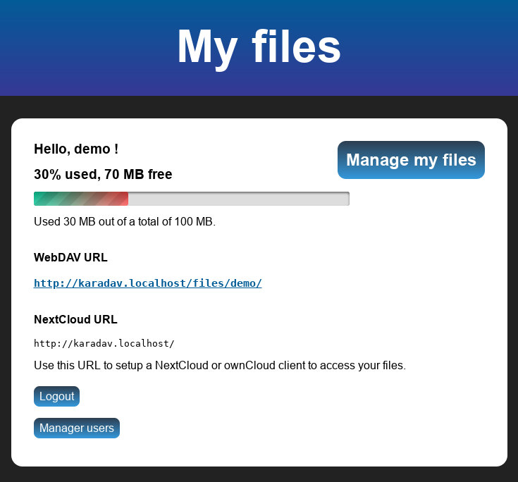

<!--
N.B.: This README was automatically generated by https://github.com/YunoHost/apps/tree/master/tools/README-generator
It shall NOT be edited by hand.
-->

# KaraDAV for YunoHost

[](https://dash.yunohost.org/appci/app/karadav)  

[](https://install-app.yunohost.org/?app=karadav)

*[Lire ce readme en français.](./README_fr.md)*

> *This package allows you to install KaraDAV quickly and simply on a YunoHost server.
If you don't have YunoHost, please consult [the guide](https://yunohost.org/#/install) to learn how to install it.*

## Overview

This is a simple and lightweight WebDAV server, allowing to easily set up a file sharing server compatible with WebDAV and NextCloud clients. It has no dependencies and good performance.

It is written in PHP (8+). The only dependency is SQLite3 for the database.

If you are looking for an even lighter WebDAV server, try [PicoDAV](https://github.com/kd2org/picodav/). It isn't compatible with NextCloud/ownCloud clients, but it is a single file that you can drop anywhere in your document root, nothing to install!  
You can easily install it using [my_webapp_ynh](https://apps.yunohost.org/app/my_webapp).

### Known issues

- [iOS NextCloud and ownCloud apps don't work, any other WebDAV app should work](https://github.com/kd2org/karadav/issues/22) (upstream bug)


**Shipped version:** 0.4.4~ynh1

## Screenshots




## Documentation and resources

* Official user documentation: <https://github.com/kd2org/karadav/blob/main/README.md>
* Official admin documentation: <https://github.com/kd2org/karadav/blob/main/README.md>
* Upstream app code repository: <https://github.com/kd2org/karadav/>
* YunoHost Store: <https://apps.yunohost.org/app/karadav>
* Report a bug: <https://github.com/YunoHost-Apps/karadav_ynh/issues>

## Developer info

Please send your pull request to the [testing branch](https://github.com/YunoHost-Apps/karadav_ynh/tree/testing).

To try the testing branch, please proceed like that.

``` bash
sudo yunohost app install https://github.com/YunoHost-Apps/karadav_ynh/tree/testing --debug
or
sudo yunohost app upgrade karadav -u https://github.com/YunoHost-Apps/karadav_ynh/tree/testing --debug
```

**More info regarding app packaging:** <https://yunohost.org/packaging_apps>
